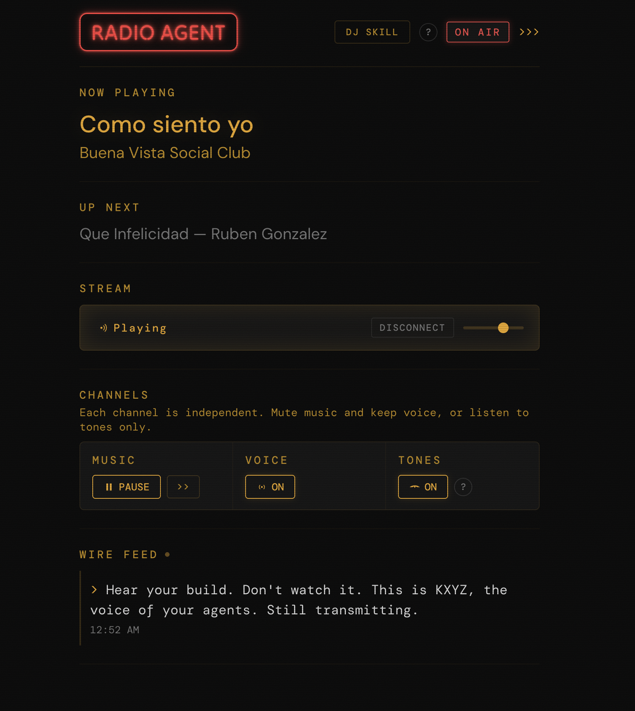

# Radio Agent

Inspired by [WRIT-FM](https://github.com/keltokhy/writ-fm), a 24/7 AI-powered internet radio station.

**[radioagent.live](https://radioagent.live)**

A LAN radio station that gives you ambient audio awareness of your AI coding agents. Music plays continuously. When agents finish tasks, hit errors, or need attention, a voice announces it over the stream. You hear what's happening from the kitchen, the couch, or wherever you are.



## Quick start

### Docker (all platforms)

```bash
git clone https://github.com/nmelo/radioagent.git
cd radioagent
docker compose up
```

### Linux bare-metal

```bash
git clone https://github.com/nmelo/radioagent.git
cd radioagent
./install.sh
```

Listen: `http://localhost:8000/stream`
Dashboard: `http://localhost:8001/`

Send an announcement:
```bash
curl -X POST http://localhost:8001/announce \
  -H 'Content-Type: application/json' \
  -d '{"detail":"Hello from Radio Agent"}'
```

## Three audio channels

| Channel | Purpose | Attention level |
|---------|---------|----------------|
| **Music** | Continuous ambient playback | Peripheral |
| **Voice** | Spoken announcements via TTS | Center-pull |
| **Tones** | Short sound effects for state changes | Peripheral |

Music sits in the background. Voice announcements duck the music and pull your attention briefly. Tones give you a sense of agent activity without words. After a day of listening, you stop consciously hearing the tones but you know when agents are busy.

Designed around [calm technology](https://calmtech.com/papers/coming-age-calm-technology) principles: information moves between periphery and center, the user controls the transition, and the system disappears into the background when not needed.

## Architecture

```
webhook POST -> Brain (FastAPI) -> Kokoro TTS -> WAV file
                                                    |
                                                    v
Music dir -> Liquidsoap [playlist + crossfade + smooth_add] -> Icecast -> listeners
```

Two processes. Brain handles webhooks, TTS, and pushes WAV paths to Liquidsoap via Unix socket. Liquidsoap handles all audio mixing, ducking, encoding, and streaming. If Brain crashes, music keeps playing.

## Stack

- **Python 3.12** with FastAPI/uvicorn
- **Kokoro TTS** (82M params, 50ms per clip on GPU, works on CPU too)
- **Liquidsoap 2.2+** for audio mixing and streaming
- **Icecast2** for HTTP audio delivery

## DJ Skill

Radio Agent ships with a Claude Code skill that transforms robotic announcements into creative radio callouts. Install it and your agents become DJs.

```bash
# Download from the dashboard or copy from skills/dj/
cp -r skills/dj ~/.claude/skills/dj
```

## Webhook API

```bash
# Simple announcement
curl -X POST http://host:8001/announce \
  -H 'Content-Type: application/json' \
  -d '{"detail":"Phase 1 is complete"}'

# With agent and event kind (triggers voice + tone)
curl -X POST http://host:8001/announce \
  -H 'Content-Type: application/json' \
  -d '{"detail":"Auth refactor done","agent":"eng1","kind":"agent.completed"}'
```

## License

MIT
